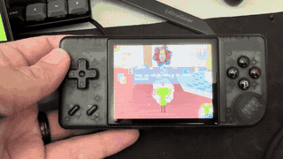

# i-port-katamari

I Love Katamari ported for sbc handhelds via portmaster, with controller first optimizations.

This port is intended for **I Love Katamari (English)**, the Android/iOS game.
It uses the Android version, whose file must be named
`MMkatamari-englishhack.apk`.

The expected SHA256 Hash of the APK should be:
`9f6017ec0eea700e47147f9bc3ed7502d073a103103141d5c556e3e8cb4092c7`

I can not help you find this file.

## Install

1. Unzip the release ZIP.
2. Copy the extracted `katamari/` folder into the handheld's `ports/`
   directory.
3. Copy `MMkatamari-englishhack.apk` into `ports/katamari/`.
4. Copy `Katamari.sh` into `ROMS/PORTS/`.
5. Launch I Love Katamari from your ports directory of your SBC's firmware.

## Controls
| Control | Action |
|---|---|
| D-pad | Move the on-screen pointer |
| A | Tap at the pointer |
| B | Tap the screen center (rapid press to boost roll) |
| X | Tap reverse/180 |
| L2 | Tap reverse/180 |
| Y/R2 | Mode shift Dpad to control Katamari |
| D-pad in accelerometer mode | Roll/tilt the katamari |
| L1 | Strafe left while held |
| R1 | Strafe right while held |
| Start | Pause through the in-game pause button |

Tested on an RG28XX running MuOS, leveraging mode shift for switching D pad from cursor to acting as accelerometer. 

YMMV on devices with an analogue stick.
